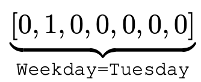
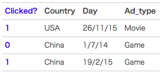
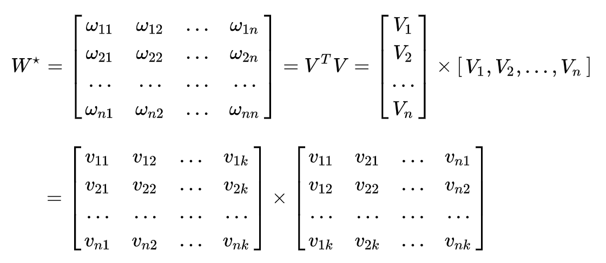
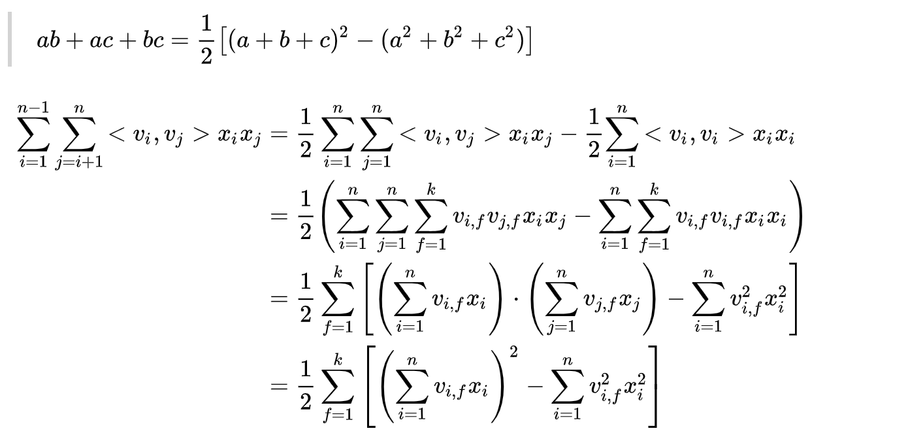
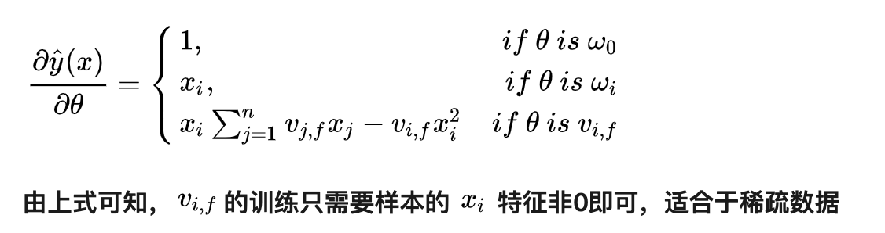

# 目录

[toc]

# 简介

CTR预估是计算广告和推荐系统中相当重要的一项工作。一般是根据用户与产品（广告或商品）的信息，预测用户的点击率。在FM之前，工业界一般采用LR作为项目的baseline模型，但是LR模型过于简单，只能独立的处理各个特征，无法捕捉到各个特征之间的相关性特征。例如，女性一般与化妆品相关的商品具有一定的联系，男性一般与球类相关的商品具有一定的联系，因此性别为女这个特征属性与商品类别为化妆品这个特征属性需要表征出它们的密切关系，男性也同样。
FM(Factorization Machine),也叫因子分解机，通过在LR的基础上对各个特征属性之间表征属性之间的亲密关系进而提升预测效果。

# 特征稀疏问题

one-hot encoding，也叫独热向量编码，就是将同一类别特征的不同属性用01二进制格式编码表示出来，这样做可以帮助计算机更好的理解训练数据。例如日期周这个类别特征，星期二的表示方法如下：

上面只给出了一个类别特征表示，下面再多给几个看一下：

从上图可知，Clicked？表示用户是否点击，1表示点击，0表示没有点击。特征信息包含三个主要特征，它们分别是Country、Day、Ad_type，如果对其进行one-hot编码，其编码之后对形式如下：

从上图可以简单看出，经过one-hot编码之后，整体数据变得很稀疏。如果把这个操作迁移到电商平台，假设淘宝或者京东上的item为100万，如果对item这个维度进行one-hot编码，光这一个维度数据的稀疏度就是百万分之一。由此可见，数据的稀疏性，是我们在实际应用场景中面临的一个非常常见的挑战与问题。

# 对特征进行组合

普通的线性模型，我们都是将各个特征独立考虑的，并没有考虑到特征与特征之间的相互关系。但实际上，大量的特征之间是有关联的。正如第一节所提到的，如果我们能将这些有关联的特征找出来，显然是很有意义的。
一般的线性模型为：
$$
y = w_{0} + \sum^{n}_{i=1}w_{i}x_{i}
$$
从上面的式子很容易看出，一般的线性模型压根没有考虑特征间的关联。为了表述特征间的相关性，我们采用多项式模型。在多项式模型中，特征 $x_{i}$ 与 $x_{j}$ 的组合用 $x_{i}x_{j}$ 表示。为了简单起见，我们讨论**二阶**多项式模型。具体的模型表达式如下：
$$
y = w_0 + \sum^{n}_{i=1}w_{i}x_{i} + \sum^{n-1}_{i=1}\sum^{n}_{j=i+1}w_{ij}x_{i}x_{j}
$$
上式中，n表示样本的特征数量，$x_{i}$表示第i个特征。与线性模型相比，FM的模型就多了后面特征组合的部分。

# FM公式推导

从上面的公式很容易看出，组合的部分的特征相关参数共有$\frac{n(n-1)}{2}$个。但是如第二部分所分析，在数据很稀疏的情况下，满足$x_{i},x_{j}$都不为零的情况非常少，这样讲导致$w_{i,j}$无法通过训练得出。

## 数学基础知识

任意的 N×N 实对称矩阵都有 N 个线性无关的特征向量。并且这些特征向量都可以正交单位化而得到一组正交且模为 1 的向量。故实对称矩阵 A 可被分解成：
$$
A = Q\bigwedge Q^{T}
$$
其中Q为正交矩阵，$\bigwedge$为实对角矩阵。

## FM核心思想

类似地，所有二次项系数$w_{ij}$可以组成一个对称阵$W$（为了方便说明FM的由来，对角元素可以设置为正实数），那么矩阵分解为$W = V^{T}V$。$V$的第$j$列($v_{j}$)便是第$j$个特征属性($x_{j}$)的隐向量。换句话说，特征分量$x_{i}$和$x_{j}$的交叉项系数是$x_{i}$对应的隐向量$v_{i}$和$x_{j}$对应的隐向量$v_{j}$的内积，即每个参数$w_{ij} = <v_{i},v_{j}>$,这就是FM的核心思想。

为了求出$w_{ij}$,我们需要求出特征分量$x_{i}$的辅助向量$v_{i} = (v_{i,1},...,v_{i,k})$与$x_{i}$的辅助向量$v_{j} = (v_{j,1},...,v_{j,k})$，k表示隐向量长度（实际应用中k<<n），转换过程如下：

隐向量可以表示之前没有出现过的交叉特征，假如在数据集中经常出现 <男，篮球> ，<女，口红>，但是没有出现过<男，口红>，<女，篮球>，这时候如果用$w_{i,j}$表示<男，口红>的系数，就会得到0。但是有了男特征和化妆品特征的隐向量之后，就可以来求解<v男，v口红>来求解。

## 公式推导

> $ab + ac + bc = \frac{1}{2}[(a + b + c)^2 - (a^{2} + b^{2} + c^{2})]$ 

> 解释：
>
> $v_{i,f}$是一个具体的值
>
> 第1个等号：对称矩阵W对角线上半部分；
>
> 第2个等号：把向量内积$v_{i}$和$v_{j}$展开成累加和的形式；
>
> 第3个等号：提出公共3部分；
>
> 第4个等号：i和j相当于是一样的，表示成平方过程。

梯度下降：

显然，$\sum^{k}_{f=1}\sum^{n}_{j=1}v_{j,f}x_{j}$的复杂度为$O(kn)$,模型参数一共有$1+n+kn$个，因此FM参数训练的复杂度也是$O(kn)$。综上可知，FM可以在**线性时间**内训练和预测，是一种非常高效的模型。

# Reference

1. [https://blog.csdn.net/bitcarmanlee/article/details/52143909](https://blog.csdn.net/bitcarmanlee/article/details/52143909)
2. [https://zhuanlan.zhihu.com/p/37963267](https://zhuanlan.zhihu.com/p/37963267)
3. [https://www.jianshu.com/p/152ae633fb00](https://www.jianshu.com/p/152ae633fb00)